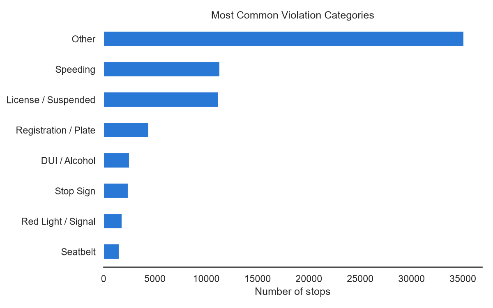
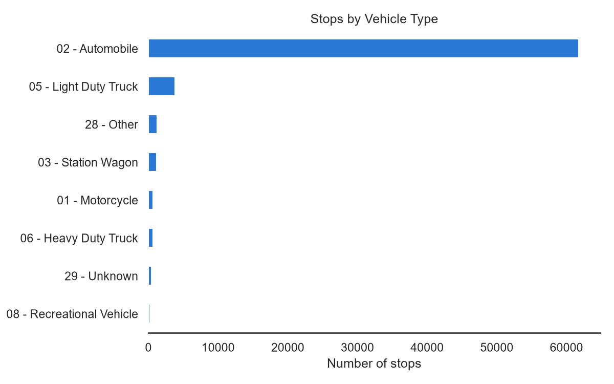
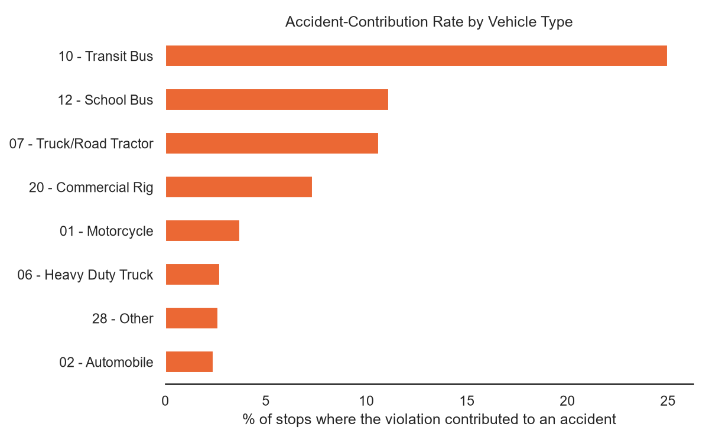
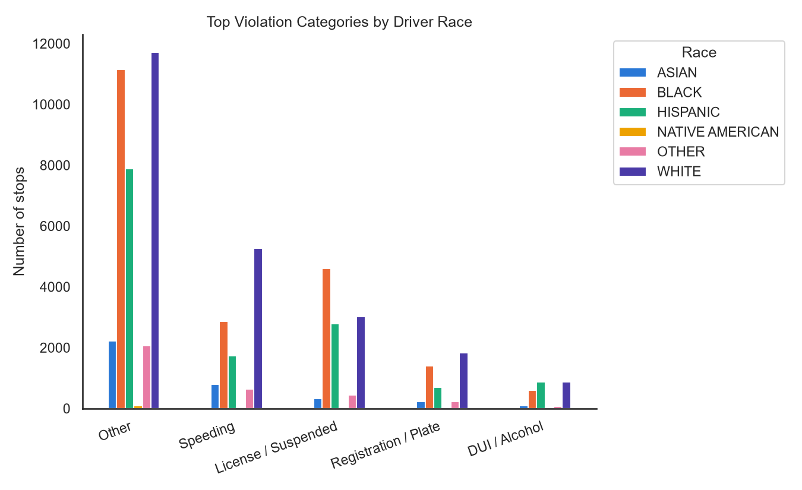
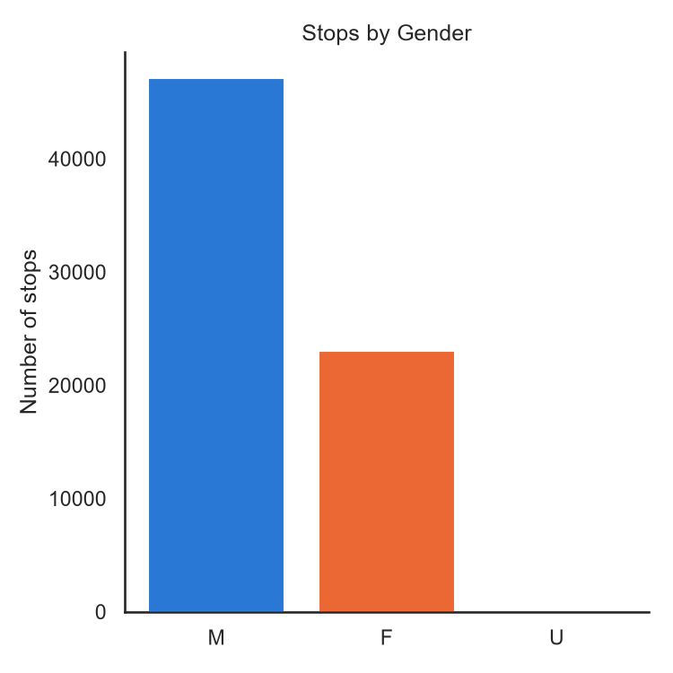

# EDA Report - Traffic Violations Insight System

Cleaned dataset: **70,241** stops (after de-duplication).

## Most Common Violations

Top category: **Other** (35,101 stops, 50.0% of all stops).

## Vehicle Types Involved

Automobiles dominate the stops (61,750), unsurprisingly, but the accident-contribution rate tells a different story - see below.

Transit buses, school buses, and road tractors show the highest share of stops that contributed to an accident, even though they make up a small fraction of total stops. Worth flagging to a safety board even though the raw counts are small.

## Demographics vs Violation Type

Stops skew male (47,093 vs 23,058 female). 'Other' is consistently the largest single violation-group bucket across every race, which just reflects how varied the free-text descriptions are - see `categorize_violation()` in clean_data.py for the exact keyword rules that would need expanding to split it further.

## Accidents, Injuries & Damage

- Contributed to an accident: **1,684** stops (2.40%)
- Personal injury reported: **805** stops (1.15%)
- Property damage reported: **1,355** stops (1.93%)

## Most Frequently Cited Vehicles

Make: **HONDA**, Model: **ACCORD**. Matches the Streamlit dashboard's vehicle-makes chart, which lets you drill into this per filter.

## What This Data Can't Tell Us

The spec for this project also asks about hotspots, time-of-day patterns, and weekday/month trends. `raw_traffic.csv` doesn't include a stop date, stop time, location, or lat/long - those columns exist in the full public dataset this project is modeled on, but weren't part of this export. `clean_data.py` will pick them up automatically if a richer export is dropped in later, but nothing in this report or the dashboard depends on them being there.